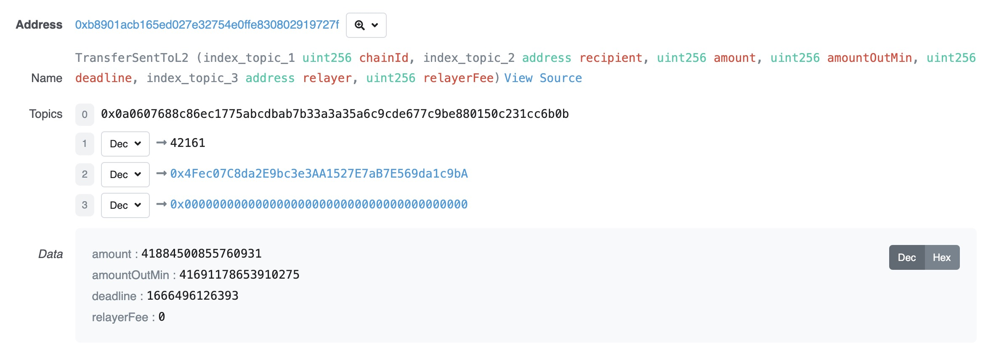

# 熟悉数据表

以Dune为代表的数据平台将区块链数据解析保存到数据库中。数据分析师针对具体的分析需求，编写SQL从相应的数据表中查询数据进行分析。目前市面上流行的区块链越来越多，新的区块链还在不断出现，部署到不同区块链上的各类项目也越来越丰富。如何快速找到待分析的项目对应的数据表，理解掌握对应数据表里每个字段的含义和用途，是每一个分析师必须掌握的技能。

目前我们熟悉的几个数据平台提供的基础数据集的整体结构比较相似，我们这里只围绕Dune平台来讲解。如果你偏好使用其他数据平台，可以通过该平台对应的文档了解详情。由于Dune已经正式宣布在2023年内全面切换到Dune SQL查询引擎，我们已将本教程中的全部Query升级到Dune SQL 版本。

## Dune V2数据引擎数据表介绍

Dune 平台的数据集分为几种不同的类型：
- **原始数据（Raw）**：存储了未经编辑的区块链数据。包括blocks、transactions、traces等数据表。这些原始数据表保存了最原始的链上数据，可用于灵活的数据分析。
- **已解析项目（Decoded Projects）**：存储了经过解码后的智能合约事件日志及调用数据表。比如Uniswap V3相关的表，Opensea Seaport相关的表等。Dune使用智能合约的 ABI(Application Binary Interface) 和标准化代币智能合约的接口标准（ERC20、ERC721 等）来解析数据，并将每一个事件或者方法调用的数据单独保存到一个数据表中。
- **魔法表（Spells）**：魔法表在Dune V1中也叫抽象表（Abstractions），是Dune和社区用户一起通过spellbook github存储库来建设和维护，并通过dbt编译生成的数据表，这些数据表通常使用起来更为便捷高效。
- **社区贡献数据（Community）**：这部分是由第三方合作组织提供的数据源，自动接入到Dune的数据集里供分析师使用。目前Dune上主要有`flashbots`和`reservoir`两个社区来源数据集。
- **用户生成的数据表（User Generated Tables）**：目前Dune V2引擎尚未开放此功能，只能通过魔法表的方式来上传（生成）自定义数据表。

在Dune平台的Query编辑页面，我们可以通过左边栏来选择或搜索需要的数据表。这部分界面如下图所示：


图片中间的文本框可以用于搜索对应的数据模式(Schema)或数据表。比如，输入`erc721`将筛选出名称包含这个字符串的所有魔法表和已解析项目表。图片中上方的红框部分用于选择要使用的数据集，途中显示的“v2 Dune SQL”就是我们通常说的“Dune SQL引擎”。Dune 将于2023年下半年全面过渡到Dune SQL引擎，所以现在大家只需熟悉Dune SQL的语法即可。

上图中下方的红框圈出的是前面所述Dune V2 引擎目前支持的几大类数据集。点击粗体分类标签文字即可进入下一级浏览该类数据集中的各种数据模式以及各模式下的数据表名称。点击分类标签进入下一级后，你还可以看到一个默认选项为“All Chains”的下拉列表，可以用来筛选你需要的区块链下的数据模式和数据表。当进入到数据表层级时，点击表名可以展开查看表中的字段列表。点击表名右边的“》”图标可以将表名（格式为`schema_name.table_name`插入到查询编辑器中光标所在位置。分级浏览的同时你也可以输入关键字在当前浏览的层级进一步搜索过滤。不同类型的数据表有不同的层次深度，下图为已解析数据表的浏览示例。


## 原始数据表

区块链中典型的原始数据表包括：区块表（Blocks）、交易表（Transactions）、内部合约调用表（Traces）、事件日志表（Logs）以及合约创建跟踪表（creation_traces）。原始数据表的命名格式为`blockchain_name.table_name`，例如arbitrum.logs，bnb.blocks，ethereum.transactions，optimism.traces等。部分区块链有更多或者更少的原始数据表，我们使用以太坊为例做简单介绍。

### 区块表（ethereum.blocks）
区块（Block）是区块链的基本构建组件。一个区块包含多个交易记录。区块表记录了每一个区块生成的日期时间(block time)、对应的区块编号(block number)、区块哈希值、难度值、燃料消耗等信息。除了需要分析整个区块链的区块生成状况、燃料消耗等场景外，我们一般并不需要关注和使用区块表。其中最重要的是区块生成日期时间和区块编号信息，它们几乎都同时保存到了其他所有数据表中，只是对应的字段名称不同。

### 交易表（ethereum.transactions）

交易表保存了区块链上发生的每一个交易的详细信息（同时包括成功交易和失败交易）。以太坊的交易表结构如下图所示：


交易表中最常用的字段包括block_time（或block_number）、from、to、value、hash、success等。Dune V2引擎是基于列存贮的数据库，每个表里的数据是按列存贮的。按列存贮的数据表无法使用传统意义上的索引，而是依赖于保存有“最小值/最大值”属性的元数据来提升查询性能。对于数值类型或者日期时间类型，可以很容易计算出一组值中的最小值/最大值。相反，对于字符串类型，因为长度可变，很难高效计算出一组字符串数据中的最小值/最大值。这就导致V2引擎在做字符串类型的查询时比较低效，所以我们通常需要同时结合使用日期时间类型或者数值类型的过滤条件来提升查询执行性能。如前所述，block_time, block_number字段几乎存在于所有的数据表中（在不同类型数据表中名称不同），我们应充分利用它们来筛选数据，确保查询可以高效执行。更多的相关信息可以查看[Dune V2查询引擎工作方式](https://docs.dune.com/dune-engine-v2-beta/query-engine#changes-in-how-the-database-works)来了解。

### 内部合约调用表（ethereum.traces）

一个交易（Transactions）可以触发更多的内部调用操作，一个内部调用还可能进一步触发更多的内部调用。这些调用执行的信息会被记录到内部合约调用表。内部合约调用表主要包括block_time、block_number、tx_hash、success、from、to、value、type等字段。

内部合约调用表有两个最常见的用途：
1. 用于跟踪区块链原生代币（Token）的转账详情或者燃料消耗。比如，对于以太坊，用户可能通过某个DAPP的智能合约将ETH转账到另一个（或者多个）地址。这种情况下，`ethereum.transactions`表的`value`字段并没有保存转账的ETH的金额数据，实际的转账金额只保存在内部合约调用表的`value`值中。另外，由于原生代币不属于ERC20代币，所以也无法通过ERC20协议的Transfer事件来跟踪转账详情。区块链交易的燃料费用也是用原生代币来支付的，燃料消耗数据同时保存于交易表和内部合约调用表。一个交易可能有多个内部合约调用，调用内部还可以发起新的调用，这就导致每个调用的`from`，`to`并不一致，也就意味着具体支付调用燃料费的账户地址不一致。所以，当我们需要计算某个地址或者一组地址的原生代币ETH余额时，只有使用`ethereum.traces`表才能计算出准确的余额。 这个查询有计算ETH余额的示例：[ETH顶级持有者余额](https://dune.com/queries/1001498/1731554)
2. 用于筛选合约地址。以太坊上的地址分为两大类型，外部拥有的地址（External Owned Address, EOA）和合约地址（Contract Address）。EOA外部拥有地址是指由以太坊用户拥有的地址，而合约地址是通过部署智能合约的交易来创建的。当部署新的智能合约时，`ethereum.traces`表中对应记录的`type`字段保存的值为`create`。我们可以使用这个特征筛选出智能合约地址。Dune V2里面，Dune团队已经将创建智能合约的内部调用记录整理出来，单独放到了表`ethereum.creation_traces`中。通过直接查询这个表就能确定某个地址是不是合约地址。

### 事件日志表（ethereum.logs）

事件日志表存储了智能合约生成的所有事件日志。当我们需要查询分析那些尚未被解码或者无法解码（由于代码非开源等原因）的智能合约，事件日志表非常有用。通常，我们建议优先使用已解析的数据表，这样可以提高效率并降低在查询中引入错误的可能性。但是，有时由于时效性（合约还未来得及被解码）或者合约本身不支持被解码的原因，我们就不得不直接访问事件日志表来查询数据进行分析。

事件日志表主要包括block_time、block_number、tx_hash、contract_address、topic1、topic2、topic3、topic4、data等字段。使用时需要注意的要点包括：
- `topic1` 存贮的是事件对应的方法签名的哈希值。我们可以同时使用contract_address 和topic1筛选条件来找出某个智能合约的某个方法的全部事件日志记录。
- `topic2`、`topic3`、`topic4` 存贮的是事件日志的可索引参数（主题），每个事件最多支持3个可索引主题参数。当索引主题参数不足3个时，剩余的字段不保存任何值。具体到每一个事件，这几个主题参数所保存的值各不相同。我们可以结合EtherScan这样的区块链浏览器上显示的日志来对照确认每一个主题参数代表什么含义。或者也可以查阅对应智能合约的源代码来了解事件参数的详细定义。
- `data`存贮的是事件参数中没有被标记为索引主题类型的其他字段的16进制的组合值，字符串格式，以`0x`开头，每个参数包括64个字符，实际参数值不足64位则在左侧填充`0`来补足位数。当我们需要从data里面解析数据时，就要按照上述特征，从第3个字符开始，以每64个字符为一组进行拆分，然后再按其实际存贮的数据类型进行转换处理（转为地址、转为数值或者字符串等）。

这里是一个直接解析logs表的查询示例：[https://dune.com/queries/1510688](https://dune.com/queries/1510688)。你可以复制查询结果中的tx_hash值访问EtherScan站点，切换到“Logs”标签页进行对照。下图显示了EtherScan上的例子：



## 已解析项目表

已解析项目表是数量最庞大的数据表类型。当智能合约被提交到Dune进行解析时，Dune为其中的每一个方法调用（Call）和事件日志（Event）生成一个对应的专用数据表。在Dune的查询编辑器的左边栏中，这些已解析项目数据表按如下层级来逐级展示：

```
category name -> project name (namespace) -> contract name -> function name / event name

-- Sample
Decoded projects -> uniswap_v3 -> Factory -> PoolCreated
```

已解析项目表的命名规则如下：
事件日志：`projectname_blockchain.contractName_evt_eventName`
函数调用：`projectname_blockchain.contractName_call_functionName`
例如，上面的Uniswap V3 的 PoolCreated 事件对应的表名为`uniswap_v3_ethereum.Factory_evt_PoolCreated`。

一个非常实用的方法是查询`ethereum.contracts`魔法表来确认你关注的智能合约是否已经被解析。这个表存贮了所有已解析的智能合约的记录。如果查询结果显示智能合约已被解析，你就可以用上面介绍的方法在查询编辑器界面快速浏览或搜索定位到对应的智能合约的数据表列表。如果查询无结果，则表示智能合约尚未被解析，你可以将其提交给Dune团队去解析处理：[提交解析新合约](https://dune.com/contracts/new)。可以提交任意的合约地址，但必须是有效的智能合约地址并且是可以被解析的（Dune能自动提取到其ABI代码或者你有它的ABI代码）。

我们制作了一个数据看板，你可以直接查询[检查智能合约是否已被解码](https://dune.com/sixdegree/decoded-projects-contracts-check)

## 魔法表

魔法书（Spellbook）是一个由Dune社区共同建设的数据转换层项目。魔法（Spell）可以用来构建高级抽象表格，魔法可以用来查询诸如 NFT 交易表等常用概念数据。魔法书项目可自动构建并维护这些表格，且对其数据质量进行检测。 Dune社区中的任何人都可以贡献魔法书中的魔法，参与方式是提交github PR，需要掌握github源代码管理库的基本使用方法。如果你希望参与贡献魔法表，可以访问[Dune Spellbook](https://dune.com/docs/spellbook/)文档了解详情。

Dune社区非常活跃，已经创建了非常多的魔法表。其中很多魔法表已被广泛使用在我们的日常数据分析中，我们在这里对重要的魔法表做一些介绍。

### 价格信息表（prices.usd，prices.usd_latest）

价格信息表`prices.usd`记录了各区块链上主流ERC20代币的每分钟价格。当我们需要将将多种代币进行统计汇总或相互对比时，通常需要关联价格信息表统一换算为美元价格和金额后再进行汇总或对比。价格信息表目前提供了以太坊、BNB、Solana等链的常见ERC20代币价格信息，精确到每分钟。如果你需要按天或者按小时的价格，可以通过求平均值的方式来计算出平均价格。下面两个示例查询演示了两种同时获取多个token的每日价格的方式：
- [获取每日平均价格](https://dune.com/queries/1507164)
- [获取每天的最后一条价格数据](https://dune.com/queries/1506944)

最新价格表（prices.usd_latest）提供了相关ERC20代币的最新价格数据。

### DeFi交易信息表(dex.trades，dex_aggregator.trades)

DeFi交易信息表`dex.trades`提供了主流DEX交易所的交易数据，因为各种DeFi项目比较多，Dune社区还在进一步完善相关的数据源，目前已经集成的有uniswap、sushiswap、curvefi、airswap、clipper、shibaswap、swapr、defiswap、dfx、pancakeswap_trades、dodo等DEX数据。DeFi交易信息表是将来自不同项目的交易信息合并到一起，这些项目本身也有其对应的魔法表格，比如Uniswap 有`uniswap.trades`，CurveFi有`curvefi_ethereum.trades`等。如果我们只想分析单个DeFi项目的交易，使用这些项目特有的魔法表会更好。

DEX聚合器交易表`dex_aggregator.trades`保存了来自DeFi聚合器的交易记录。这些聚合器的交易通常最终会提交到某个DEX交易所执行。单独整理到一起可以避免与`dex.trades`记录重复计算。编写本文时，暂时还只有`cow_protocol`的数据。

### Tokens表（tokens.erc20，tokens.nft）

Tokens表目前主要包括ERC20代币表`tokens.erc20`和NFT表（ERC721）`tokens.nft`。`tokens.erc20`表记录了各区块链上主流ERC20代币的定义信息，包括合约地址、代币符号、代币小数位数等。`tokens.nft`表记录了各NFT项目的基本信息，这个表的数据源目前还依赖社区用户提交PR来进行更新，可能存在更新延迟、数据不完整等问题。由于区块链上数据都是已原始数据格式保存的，金额数值不包括小数位数，我们必须结合`tokens.erc20`中的小数位数才能正确转换出实际的金额数值。

### ERC代表信息表（erc20_ethereum.evt_Transfer，erc721_ethereum.evt_Transfer等）

ERC代币信息表分别记录了ERC20， ERC721（NFT），ERC1155等几种代币类型的批准（Approval）和转账（Transfer）记录。当我们要统计某个地址或者一组地址的ERC代币转账详情、余额等信息是，可以使用这一组魔法表。

### ENS域名信息表（ens.view_registrations等）

ENS域名信息相关的表记录了ENS域名注册信息、反向解析记录、域名更新信息等。

### 标签信息表（labels.all等）

标签信息表是一组来源各不相同的魔法表，允许我们将钱包地址或者合约地址关联到一个或者一组文字标签。其数据来源包括ENS域名、Safe钱包、NFT项目、已解析的合约地址等多种类型。当我们的查询中希望把地址以更直观更有可读性的方式来显示是，可以通过Dune内置的`get_labels()`函数来使用地址标签。

### 余额信息表（balances_ethereum.erc20_latest等）

余额信息表保存了每个地址每天、每小时、和最新的ERC20， ERC721（NFT），ERC1155几种代币的余额信息。如果我们要计算某组地址的最新余额，或者跟踪这些地址的余额随时间的变化情况，可以使用这一组表。

### NFT交易信息表（nft.trades等）

NFT交易信息表记录了各NFT交易平台的NFT交易数据。目前集成了opensea、magiceden、looksrare、x2y2、sudoswap、foundation、archipelago、cryptopunks、element、superrare、zora、blur等相关NFT交易平台的数据。跟DeFi交易数据类似，这些平台也各自有对应的魔法表，比如`opensea.trades`。当只需分析单个平台时，可以使用它特有的魔法表。

### 其他魔法表

除了上面提到的魔法表之外，还有很多其他的魔法表。Dune的社区用户还在不断创建新的魔法表。要了解进一步的信息，可以访问[Dune 魔法书](https://spellbook-docs.dune.com/#!/overview)文档网站。

## 社区贡献数据和用户生成数据表

如前文所述，目前Dune上主要有`flashbots`和`reservoir`两个社区来源数据集。Dune文档里面分别对这两个数据集做了简介：

[Dune社区来源数据表](https://dune.com/docs/reference/tables/community/)


## SixDegreeLab介绍

SixDegreeLab（[@SixdegreeLab](https://twitter.com/sixdegreelab)）是专业的链上数据团队，我们的使命是为用户提供准确的链上数据图表、分析以及洞见，并致力于普及链上数据分析。通过建立社区、编写教程等方式，培养链上数据分析师，输出有价值的分析内容，推动社区构建区块链的数据层，为未来广阔的区块链数据应用培养人才。

欢迎访问[SixDegreeLab的Dune主页](https://dune.com/sixdegree)。

因水平所限，不足之处在所难免。如有发现任何错误，敬请指正。
