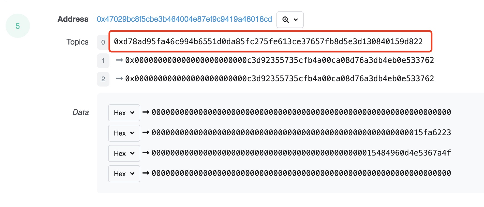

# 常见查询一：ERC20代币价格查询

在日常的数据分析中，我们经常会接到一些常见的需求，比如跟踪某个ERC20代币的价格变化、查询某个地址持有的各种ERC20代币余额等。在Dune平台的帮助文档里面，[一些有用的数据看板](https://dune.com/docs/reference/wizard-tools/helpful-dashboards/)和[实用查询](https://dune.com/docs/reference/wizard-tools/utility-queries/)部分分别给出了一些实例，大家可以参考。本篇教程中我们结合自己日常遇到的一些典型需求，整理一些查询案例给大家。

## 查询单个ERC20代币的最新价格

很多区块链项目都涉及ERC20代币，DeFi类的项目允许用户交换他们持有的ERC20代币，其他一些项目通过发行ERC20代币来募集资金或者通过分配计划、空投等方式回馈投资人、早期用户和项目方团队等。像[CoinGecko](https://www.coingecko.com/)这样的网站有提供各种ERC20代币的价格信息。Dune也将各区块链上常见的ERC20代币的价格信息整理到了`prices.usd`表和`prices.usd_latest`表中，方便数据分析师使用。[prices.usd](https://dune.com/docs/reference/tables/prices/)表记录了各种ERC20代币的每分钟价格信息。我们在分析ERC20代币相关的项目时，可以结合价格数据，将各种不同代币的金额转换为以美元表示的金额，就能进行汇总、对比等操作。

**获取单个ERC20代币的最新价格:**

`prices.usd`表中的价格是按分钟记录的，我们只需要根据代币的符号及其归属的区块链取最新的一条记录即可，如果有合约地址，也可以使用合约地址来查询。`usd_latest`表中则记录了每种代币的最新价格，每个代币只有一行记录。以下几种方式都可以查询单个代币（以WETH为例）的最新价格。因为价格信息按每分钟每个代币一条记录的方式保存，具体到每一个代币其记录数量也很庞大，我们通过限制读取最新的部分数据来提高查询的效率。由于偶尔可能会存在一定的延迟，下面的实例中我们从过去6小时的记录里面读取最新的一条，确保能取到价格。

**使用代币符号值读取`prices.usd`表的最新价格信息：**

```sql
select * from prices.usd
where symbol = 'WETH'
    and blockchain = 'ethereum'
    and minute >= now() - interval '6' hour
order by minute desc
limit 1
```

**使用代币的合约地址读取`prices.usd`表的最新价格：**

```sql
select * from prices.usd
where contract_address = 0xc02aaa39b223fe8d0a0e5c4f27ead9083c756cc2   -- WETH
    and minute >= now() - interval '6' hour
order by minute desc
limit 1
```

**从`prices.usd_latest`表读取最新价格信息：**

```sql
select * from prices.usd_latest
where symbol = 'WETH'
    and blockchain = 'ethereum'
```

读取`prices.usd_latest`表的查询更加简洁。但是因为它实际上是`prices.usd`表的一个视图（参考源代码：[prices_usd_latest](https://github.com/duneanalytics/spellbook/blob/main/models/prices/prices_usd_latest.sql)），相比来说查询执行的效率略低。


## 查询多个ERC20代币的最新价格

当我们需要同时读取多个Token的最新价格时，`prices.usd_latest`表的便利性就体现出来了。这里我们以同时查询WETH、WBTC和USDC的最新价格为例。


**从`prices.usd_latest`表读取多个代币的最新价格信息：**

```sql
select * from prices.usd_latest
where symbol in ('WETH', 'WBTC', 'USDC')
    and blockchain = 'ethereum'
```

**从`prices.usd`表读取多个代币的最新价格信息：**

```sql
select symbol, decimals, price, minute
from (
    select row_number() over (partition by symbol order by minute desc) as row_num, *
    from prices.usd
    where symbol in ('WETH', 'WBTC', 'USDC')
        and blockchain = 'ethereum'
        and minute >= now() - interval '6' hour
    order by minute desc
) p
where row_num = 1
```

因为我们要同时读取多个代币的最新价格，就不能简单地使用`limit`子句限制结果数量来得到需要的结果。因为我们实际需要返回的是每个不同的代币分别按`minute`字段降序排序后取第一条记录。上面的查询中，我们使用了`row_number() over (partition by symbol order by minute desc) as row_num`来生成一个新的列，这个列的值按照`symbol`分组并按`minute`字段降序排序来生成，即每个不同的代币都会生成自己的1，2，3，4...这样的行号序列值。我们将其放到一个子查询中，外层查询中筛选`where row_num = 1`的记录，就是每个代币最新的记录。这种方法看起来稍显复杂，但是实际应用中经常需要用到类似的查询，通过`row_number()`函数生成新的列然后用于过滤数据。

## 查询单个ERC20代币的每日平均价格

当我们需要查询某个ERC20代币每一天的平均价格时，只能使用`prices.usd`表来实现。通过设置要查询价格的日期范围（或者不加日期范围取全部日期的数据），按天汇总，使用`avg()`函数求得平均值，就可以得到按天的价格数据。SQL如下：

```sql
select date_trunc('day', minute) as block_date,
    avg(price) as price
from prices.usd
where symbol = 'WETH'
    and blockchain = 'ethereum'
    and minute >= date('2023-01-01')
group by 1
order by 1
```

如果我们同时还需要返回其他字段，可以把它们加入SELECT列表并同时加入到GROUP BY里面。这是因为，当使用`group by`子句时，SELECT列表中出现的字段如果不是汇总函数就必须同时出现在GROUP BY子句中。SQL修改后如下：

```sql
select date_trunc('day', minute) as block_date,
    symbol,
    decimals,
    contract_address,
    avg(price) as price
from prices.usd
where symbol = 'WETH'
    and blockchain = 'ethereum'
    and minute >= date('2023-01-01')
group by 1, 2, 3, 4
order by 1
```

## 查询多个ERC20代币的每日平均价格

类似地，我们可以同时查询一组ERC20代币每一天的平均价格，只需将要查询的代币的符号放入`in ()`条件子句里面即可。SQL如下：

```sql
select date_trunc('day', minute) as block_date,
    symbol,
    decimals,
    contract_address,
    avg(price) as price
from prices.usd
where symbol in ('WETH', 'WBTC', 'USDC')
    and blockchain = 'ethereum'
    and minute >= date('2022-10-01')
group by 1, 2, 3, 4
order by 2, 1   -- Order by symbol first
```

## 从DeFi兑换记录计算价格

Dune上的价格数据表`prices.usd`是通过spellbook来维护的，里面并没有包括所有支持的区块链上面的所有代币的价格信息。特别是当某个新的ERC20代币新发行上市，在DEX交易所进行流通（比如XEN），此时Dune的价格表并没有这个代币的数据。此时，我们可以读取DeFi项目中的兑换数据，比如Uniswap中的Swap数据，将对应代币与USDC（或者WETH）之间的兑换价格计算出来，再通过USDC或WETH的价格数据换算得到美元价格。示例查询如下：

```sql
with xen_price_in_usdc as (
    select date_trunc('hour', evt_block_time) as block_date,
        'XEN' as symbol,
        '0x06450dee7fd2fb8e39061434babcfc05599a6fb8' as contract_address, -- XEN
        18 as decimals,
        avg(amount1 / amount0) / pow(10, (6-18)) as price   --USDC: 6 decimals, XEN: 18 decimals
    from (
        select contract_address,
            abs(amount0) as amount0,
            abs(amount1) as amount1,
            evt_tx_hash,
            evt_block_time
        from uniswap_v3_ethereum.Pair_evt_Swap
        where contract_address = '0x353bb62ed786cdf7624bd4049859182f3c1e9e5d'   -- XEN-USDC 1.00% Pair
            and evt_block_time > '2022-10-07'
            and evt_block_time > now() - interval '30 days'
    ) s
    group by 1, 2, 3, 4
),

usdc_price as (
    select date_trunc('hour', minute) as block_date,
        avg(price) as price
    from prices.usd
    where contract_address = '0xa0b86991c6218b36c1d19d4a2e9eb0ce3606eb48'   -- USDC
        and minute > '2022-10-07'
        and minute > now() - interval '30 days'
    group by 1
)

select x.block_date,
    x.price * u.price as price_usd
from xen_price_in_usdc x
inner join usdc_price u on x.block_date = u.block_date
order by x.block_date
```

上面这个查询是我们在XEN Crypto项目的数据看板中的一个实际应用，参考链接如下：
- 数据看板：[XEN Crypto Overview](https://dune.com/sixdegree/xen-crypto-overview)
- 查询：[XEN - price trend](https://dune.com/queries/1382200)

## 从DeFi交易魔法表计算价格

如果相应的DeFi交易数据已经集成到了`dex.trades`表中，那么使用该表来计算价格会更加简单。我们可以将`amount_usd`与`token_bought_amount`或者`token_sold_amount`相除，得到对应代币的USD价格。以Uniswap V3 下的 USDC-WETH 0.30% 为例，计算WETH最新价格的SQL如下：

```sql
with trade_detail as (
    select block_time,
        tx_hash,
        amount_usd,
        token_bought_amount,
        token_bought_symbol,
        token_sold_amount,
        token_sold_symbol
    from dex.trades
    where project_contract_address = 0x8ad599c3a0ff1de082011efddc58f1908eb6e6d8
        and block_date >= now() - interval '3' day
    order by block_time desc
    limit 1000
)

select avg(
    case when token_bought_symbol = 'WETH' then amount_usd / token_bought_amount
        else amount_usd / token_sold_amount
    end
    ) as price
from trade_detail
```

## 计算原生代币（ETH）的价格

以Ethereum为例，其原生代币ETH并不属于ERC20代币，所以`prices.usd`表里并没有ETH本身的价格信息。但是，WETH 代币（Wrapped ETH）与ETH是等值的，所以我们可以直接使用WETH的价格数据。

## 借用其他区块链的价格数据

当`prices.usd`中找不到我们要分析的区块链的代币价格数据时，还有一个可以变通的技巧。例如，Avalanche-C 链也提供USDC、WETH、WBTC、AAVE等代币的交易，但是它们相对于Ethereum链分别有不同的代币地址。假如`prices.usd`未提供Avalache-C链的价格数据时（目前应该已经支持了），我们可以自定义一个CTE，将不同链上的代币地址映射起来，然后进行查询获取价格。

```sql
with token_mapping_to_ethereum(aave_token_address, ethereum_token_address, token_symbol) as (
    values
    (0xfd086bc7cd5c481dcc9c85ebe478a1c0b69fcbb9, 0xdac17f958d2ee523a2206206994597c13d831ec7, 'USDT'),
    (0x2f2a2543b76a4166549f7aab2e75bef0aefc5b0f, 0x2260fac5e5542a773aa44fbcfedf7c193bc2c599, 'WBTC'),
    (0xd22a58f79e9481d1a88e00c343885a588b34b68b, 0xdb25f211ab05b1c97d595516f45794528a807ad8, 'EURS'),
    (0xff970a61a04b1ca14834a43f5de4533ebddb5cc8, 0xa0b86991c6218b36c1d19d4a2e9eb0ce3606eb48, 'USDC'),
    (0xf97f4df75117a78c1a5a0dbb814af92458539fb4, 0x514910771af9ca656af840dff83e8264ecf986ca, 'LINK'),
    (0x82af49447d8a07e3bd95bd0d56f35241523fbab1, 0xc02aaa39b223fe8d0a0e5c4f27ead9083c756cc2, 'WETH'),
    (0xda10009cbd5d07dd0cecc66161fc93d7c9000da1, 0x6b175474e89094c44da98b954eedeac495271d0f, 'DAI'),
    (0xba5ddd1f9d7f570dc94a51479a000e3bce967196, 0x7fc66500c84a76ad7e9c93437bfc5ac33e2ddae9, 'AAVE')
),

latest_token_price as (
    select date_trunc('hour', minute) as price_date,
        contract_address,
        symbol,
        decimals,
        avg(price) as price
    from prices.usd
    where contract_address in (
        select ethereum_token_address
        from token_mapping_to_ethereum
    )
    and minute > now() - interval '1' day
    group by 1, 2, 3, 4
),

latest_token_price_row_num as (
    select  price_date,
        contract_address,
        symbol,
        decimals,
        price,
        row_number() over (partition by contract_address order by price_date desc) as row_num
    from latest_token_price
),

current_token_price as (
    select contract_address,
        symbol,
        decimals,
        price
    from latest_token_price_row_num
    where row_num = 1
)

select * from current_token_price
```

这是我们在线的示例查询：[https://dune.com/queries/1042456](https://dune.com/queries/1042456)


## 从事件日志记录计算价格

提示：本小节的内容相对比较复杂，如果觉得有难度，可以直接跳过。

一种比较特殊的情况是当分析一个新的DeFi项目或者一个Dune新近支持的区块链的时候。此时还没有相应的`prices.usd`数据，对应项目的智能合约还没有被提交解析完成，交易记录也没有被集成到`dex.trades`这样的魔法表中。此时，我们唯一能访问的就是`transactions`和`logs`这样的原始数据表。此时，我们可以先找到几个交易记录，分析在区块链上显示的事件日志的详细，确定事件的`data`值里面包含的数据类型和相对位置，再据此手动解析数据用于换算价格。

比如，我们需要计算Optimism链上$OP代币的价格，并且假定此时满足前述所有情况，必须从交易事件日志原始表来计算价格。我们先根据项目方提供的线索（合约地址、案例哈希等）找到一个兑换交易记录：[https://optimistic.etherscan.io/tx/0x1df6dda6a4cffdbc9e477e6682b982ca096ea747019e1c0dacf4aceac3fc532f](https://optimistic.etherscan.io/tx/0x1df6dda6a4cffdbc9e477e6682b982ca096ea747019e1c0dacf4aceac3fc532f)。这是一个兑换交易，其中最后一个`logs`日志的`topic1`值“0xd78ad95fa46c994b6551d0da85fc275fe613ce37657fb8d5e3d130840159d822”对应“Swap(address,uint256,uint256,uint256,uint256,address)”方法。这个可以通过查询`decoding.evm_signatures`表来进一步验证（这是因为Optimism是EVM兼容的区块链，其使用的相关函数与Ethereum相同）。

区块链浏览器上的日志部分截图如下：



evm_signatures签名数据查询的截图如下：


上图查询`evm_signatures`时我们做了一下处理以让相关各列数据从上到下显示。对应的SQL为：

```sql
select 'ID:' as name, cast(id as varchar) as value
from decoding.evm_signatures
where id = 0xd78ad95fa46c994b6551d0da85fc275fe613ce37657fb8d5e3d130840159d822
union all
select 'Signature:' as name, signature as value
from decoding.evm_signatures
where id = 0xd78ad95fa46c994b6551d0da85fc275fe613ce37657fb8d5e3d130840159d822
union all
select 'ABI:' as name, abi as value
from decoding.evm_signatures
where id = 0xd78ad95fa46c994b6551d0da85fc275fe613ce37657fb8d5e3d130840159d822
```

结合上述相关信息，我们就可以通过解析事件日志里面的Swap记录，换算出价格。在下面的查询中，我们取最新1000条交易记录来计算平均价格。因为交换是双向的，可能从`token0` 兑换为 `token1`或者与之相反，我们使用一个case语句相应取出不同的值用来计算交易的价格。另外，我们没有再进一步取得USDC的价格来换算，毕竟其本身是稳定币，价格波动较小。需要更精确的数据时，可以参考前面的例子通过USDC的价格信息换算。

```sql
with op_price as (
    select 0x4200000000000000000000000000000000000042 as token_address,
        'OP' as token_symbol,
        18 as decimals,
        avg(
            (case when amount0_in > 0 then amount1_out else amount1_in end) 
            / 
            (case when amount0_in > 0 then amount0_in else amount0_out end)
        ) as price
    from (
        select tx_hash,
            index,
            cast(bytearray_to_uint256(bytearray_substring(data, 1, 32)) as decimal(38, 0)) / 1e18 as amount0_in,
            cast(bytearray_to_uint256(bytearray_substring(data, 1 + 32, 32)) as decimal(38, 0)) / 1e6  as amount1_in,
            cast(bytearray_to_uint256(bytearray_substring(data, 1 + 32 * 2, 32)) as decimal(38, 0)) / 1e18  as amount0_out,
            cast(bytearray_to_uint256(bytearray_substring(data, 1 + 32 * 3, 32)) as decimal(38, 0)) / 1e6  as amount1_out
        from optimism.logs
        where block_time >= now() - interval '2' day
            and contract_address = 0x47029bc8f5cbe3b464004e87ef9c9419a48018cd -- OP - USDC Pair
            and topic0 = 0xd78ad95fa46c994b6551d0da85fc275fe613ce37657fb8d5e3d130840159d822   -- Swap
        order by block_time desc
        limit 1000
    )
)

select * from op_price
```

这里是一个实际使用的案例：[https://dune.com/queries/1130354](https://dune.com/queries/1130354)

## SixDegreeLab介绍

SixDegreeLab（[@SixdegreeLab](https://twitter.com/sixdegreelab)）是专业的链上数据团队，我们的使命是为用户提供准确的链上数据图表、分析以及洞见，并致力于普及链上数据分析。通过建立社区、编写教程等方式，培养链上数据分析师，输出有价值的分析内容，推动社区构建区块链的数据层，为未来广阔的区块链数据应用培养人才。

欢迎访问[SixDegreeLab的Dune主页](https://dune.com/sixdegree)。

因水平所限，不足之处在所难免。如有发现任何错误，敬请指正。
