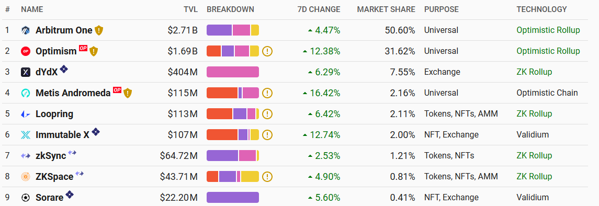
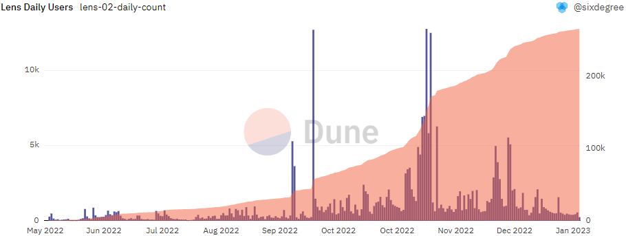

# 各类常见指标分析（一）

## 背景知识

在前面的教程中，我们学习了许多关于数据表和SQL查询语句的知识。准确规范地检索统计出所需数据是一名合格分析师的必备技能。与此同时，正确地认识和解读这些数据指标也十分关键。只有对数据指标有足够深刻的理解，它才能对我们的决策提供强力的支持。

在看具体的指标之前，我们先思考一下，我们为什么需要数据指标呢？简单地说，指标就是能够反映一种现象的数字，比如某个NFT的地板价，某家DEX的日活跃交易数。指标可以直接反映我们研究对象的状况，为相应决策提供数据支撑，我们可以通过之前学习的数据表和SQL语句知识，构建、调用、分析这些指标，达到事半功倍的效果。如果没有指标，我们获取的信息就会显得很乱，我们能够从中获得的洞察就少。

具体到区块链领域，虽然有些指标与金融市场的指标类似，但它也有相当一部分特有的指标，比如比特币市值占比（Bitcoin Dominance），交易所七日流入量（All Exchanges Inflow Mean-MA7）等。在本教程中，我们先来学习以下几个常见指标和它们的计算方法：

- 总锁仓量 Total Value Locked (TVL)
- 流通总量 Circulating Supply
- 总市值 Market Cap 
- 日/月活跃用户 Daily / Monthly Active User (DAU / MAU)
- 日/月新用户数 Daily / Monthly New User


## 总锁仓量Total Value Locked (TVL)
我们来看我们今天学习的第一个指标 - 总锁仓量Total Value Locked (TVL)。 它描述了一个协议中锁定的所有代币价值的总和，该协议可以是Dex,借贷平台,也可以是侧链，L2二层网络等等。TVL描述了该协议的流动性，同时也反映了其受欢迎程度以及用户的信心。

比如我们来看一下DEX的TVL排行：


以及二层网络L2的TVL排行：



排名靠前的均是热度比较高的协议。

TVL的计算逻辑比较简单，即统计出协议中所有相关代币的数目，再乘以每种代币的价格，最后求和得出。这里我们以Arbitrum链上的一个DEX项目Auragi为例进行说明。DEX项目的TVL通过其中的流动性池Pool的余额来体现。为了计算这个项目每一天的TVL，我们可以先统计出它每一天的所有Pair中相关代币的余额数量，以及代币在该时间点的价格，然后相乘得到以USD计算的金额。

为了得到每一天的各个Pair的代币余额，我们要先整理出所有的交易明细记录：

```sql
with token_pairs as (
    select 
        coalesce(k1.symbol, 'AGI') || '-' || coalesce(k2.symbol, 'AGI') as pair_name,
        p.pair,
        p.evt_block_time,
        p.token0,
        p.token1,
        p.stable
    from auragi_arbitrum.PairFactory_evt_PairCreated p
    left join tokens.erc20 k1 on p.token0 = k1.contract_address and k1.blockchain = 'arbitrum'
    left join tokens.erc20 k2 on p.token1 = k1.contract_address and k2.blockchain = 'arbitrum'
),

token_transfer_detail as (
    select date_trunc('minute', evt_block_time) as block_date,
        evt_tx_hash as tx_hash,
        contract_address,
        "to" as user_address,
        cast(value as decimal(38, 0)) as amount_raw
    from erc20_arbitrum.evt_Transfer
    where "to" in (select pair from token_pairs)
        and evt_block_time >= date('2023-04-04')

    union all
    
    select date_trunc('minute', evt_block_time) as block_date,
        evt_tx_hash as tx_hash,
        contract_address,
        "from" as user_address,
        -1 * cast(value as decimal(38, 0)) as amount_raw
    from erc20_arbitrum.evt_Transfer
    where "from" in (select pair from token_pairs)
        and evt_block_time >= date('2023-04-04')
),

token_price as (
    select date_trunc('minute', minute) as block_date,
        contract_address,
        decimals,
        symbol,
        avg(price) as price
    from prices.usd
    where blockchain = 'arbitrum'
        and contract_address in (select distinct contract_address from token_transfer_detail)
        and minute >= date('2023-04-04')
    group by 1, 2, 3, 4
    
    union all
    
    -- AGI price from swap trade
    select date_trunc('minute', block_time) as block_date,
        0xFF191514A9baba76BfD19e3943a4d37E8ec9a111 as contract_address,
        18 as decimals,
        'AGI' as symbol,
        avg(case when token_in_address = 0xFF191514A9baba76BfD19e3943a4d37E8ec9a111 then token_in_price else token_out_price end) as price
    from query_2337808
    group by 1, 2, 3, 4
)

select p.symbol,
    d.block_date,
    d.tx_hash,
    d.user_address,
    d.contract_address,
    d.amount_raw,
    (d.amount_raw / power(10, p.decimals) * p.price) as amount_usd
from token_transfer_detail d
inner join token_price p on d.contract_address = p.contract_address and d.block_date = p.block_date
```

上面的查询逻辑如下：
- 先在`token_pairs`中得到这个项目的所有交易对（Pair）。
- 结合`evt_Transfer`表，查询出每一个交易对的资金转入转出详情。
- 在`token_price`中计算出哥哥Token的当前价格。因为这个是一个比较新的Token，Dune可能没有它的价格数据，所以我们使用了交易数据来换算价格。交易数据的详细列表在另外一个查询中，这里使用Query of Query的方式来引用。
- 最后我们将交易明细和价格信息关联，计算出每一笔交易的USD金额。

在上面的交易详情查询结果基础上，我们就可以来统计计算每一天的TVL了。

首先我们在`date_series`中生成一个日期时间序列。考虑到这是一个比较新的项目，我们按小时纬度进行统计。如果项目上线时间已经足够久，建议按天进行统计。

然后在`pool_balance_change`中，结合上面的交易详情数据，我们整理出美国Token每一个小时的余额变化金额。

接下来在`pool_balance_summary`中，我们按时间排序汇总出每个Token的累积余额。这里同时使用`lead()`函数计算出每一个token每一个时间段存在对应后续交易记录的下一个时间点。

最后，我们将时间序列和每一个小时的累积余额进行关联，补足缺失交易数据的时间段的值。请注意这里的关联条件：`inner join date_series d on p.block_date <= d.block_date and d.block_date < p.next_date`。这里使用了两个条件，限定累计余额的日期时间必须小于等于日期序列的日期时间值，同时序列的日期时间值必须小于下一个有记录的余额的日期时间值。这是一个很常见的处理技巧。因为并不是所有的Token在每一个时间段都有交易，如果遇到没有发生交易的时间段，我们需要用前一个时间段的余额来代表其在当前时间段的余额。这个应该不难理解，因为“当前时间段”内没有发生新的变化，所以余额自然跟上一个时间段相同。

查询代码如下：

```sql
with date_series as (
    select block_date
    from unnest(sequence(timestamp '2023-04-01 00:00:00', localtimestamp, interval '1' hour)) as tbl(block_date)
),

pool_balance_change as (
    select symbol,
        date_trunc('hour', block_date) as block_date,
        sum(amount_usd) as amount
    from query_2339248
    group by 1, 2
),

pool_balance_summary as (
    select symbol,
        block_date,
        sum(amount) over (partition by symbol order by block_date) as balance_amount,
        lead(block_date, 1, current_date) over (partition by symbol order by block_date) as next_date
    from pool_balance_change
    order by 1, 2
)

select d.block_date,
    p.symbol,
    p.balance_amount
from pool_balance_summary p
inner join date_series d on p.block_date <= d.block_date and d.block_date < p.next_date
order by 1, 2
```

这样我们就能够把TVL的变化呈现出来：


以上查询的链接：
- [https://dune.com/queries/2339317](https://dune.com/queries/2339317)
- [https://dune.com/queries/2339248](https://dune.com/queries/2339248)
- [https://dune.com/queries/2337808](https://dune.com/queries/2337808)

另外一个计算TVl的例子：[https://dune.com/queries/1059644/1822157](https://dune.com/queries/1059644/1822157)

## 流通总量 Circulating Supply

流通总量是当前市场中以及持币者掌握的流通的加密货币数量。它与总供应量(Total Supply)不同，它不会将无法交易流通的部分纳入统计，比如被锁定而无法交易的货币数量。由于这部分无法流通的加密货币通常并不会影响其价格，所以流通总量作为代币数量的度量较总供应量更为常用。对于不同的加密货币，其计算方式有所不同。比如一些线性释放的代币，他的供应量随时间增加。又如一些有通缩燃烧机制的代币，我们在计算流通总量的时候就要减去这一部分。这里我们以比特币为例，计算它的当前流通总量。
比特币的流通总量计算逻辑较为简单，从起始周期每个区块产出50枚，每210000个区块进入一个减半周期。基于此，我们可以计算出它当前的流通总量：

```sql
SELECT SUM(50/POWER(2, ROUND(height/210000))) as Supply                      
FROM bitcoin.blocks
```


## 总市值 Market Cap 

今天学习的第三个指标是总市值(Market Cap)。相信大家对这个指标并不陌生。在股票市场，总市值是指在某特定时间内总股本数乘以当时股价得出的股票总价值。相应的在区块链领域，它是一种加密货币的流通总量(Circulating Supply）乘以该加密货币的价格得出的该加密货币总价值。因此计算总市值的关键是计算出我们刚刚学习的指标-流通总量。当我们计算出了流通总量，再乘以该加密货币的当前价格，就能得出其总市值。
我们继续以比特币为例，在计算出其流通总量的基础上，我们再乘以它当前的价格即可获得它的总市值：

```sql
SELECT SUM(50/POWER(2, ROUND(height/210000))) as Supply, 
       SUM(50/POWER(2, ROUND(height/210000)) * p.price) /POWER(10, 9) AS "Market Cap"
FROM bitcoin.blocks
INNER JOIN (
    SELECT price FROM prices.usd_latest
    WHERE symbol='BTC'
        AND contract_address IS NULL
) p ON TRUE
```

我们最开始提到的比特币市值占比（Bitcoin Dominance），就是以此为分子，然后以所有加密货币市值之和为分母计算出来的。


## 日/月活跃用户 Daily/Monthly Active User

今天学习的下一个指标是日/月活跃用户 (Daily/Monthly Active User,DAU/MAU)。相对于绝对交易数额，活跃用户的数目更能反应一个协议受欢迎程度。由于少数用户的大额交互就可以拉高交易数额，活跃的用户数可以更客观的描述该协议的热度。它的计算方式比较简单，我们只要找出与某个合约交易的钱包地址，并按天/月统计频数即可得出。
我们以最近比较热门的Lens为例：

```sql
with daily_count as (
    select date_trunc('day', block_time) as block_date,
        count(*) as transaction_count,
        count(distinct "from") as user_count
    from polygon.transactions
    where "to" = 0xdb46d1dc155634fbc732f92e853b10b288ad5a1d   -- LensHub
        and block_time >= date('2022-05-16')  -- contract creation date
    group by 1
    order by 1
)

select block_date,
    transaction_count,
    user_count,
    sum(transaction_count) over (order by block_date) as accumulate_transaction_count,
    sum(user_count) over (order by block_date) as accumulate_user_count
from daily_count
order by block_date
```

我们使用distinct函数让每位用户每天只会被统计一次。在统计每日活跃人数的基础上，我们还使用 `sum` `over`函数，统计出了累计用户数。如果要统计月度活跃用户数（MAU），只需要改成使用`date_trunc('month', block_time)` 来获取每月第一天的日期并进行汇总统计即可。



## 日/月新用户数 Daily / Monthly New User

除了关注活跃用户数据外，每日/每月新增用户数量也是非常常见的一个分析指标。通常，为了得到准确的新增用户数据，我们需要先计算出每个用户地址第一次交易的日期时间，或者收到/发出第一笔转账记录的日期时间，然后再按天或者月进行统计得到新增用户数量。这里我们以统计Optimism链上每日新增用户数量的查询为例。

```sql
with optimism_new_users as (
    SELECT "from" as address,
        min(block_time) as start_time
    FROM optimism.transactions
    GROUP BY 1
)

SELECT date_trunc('day', start_time) as block_date,
    count(n.address) as new_users_count
FROM optimism_new_users n
WHERE start_time >= date('2022-10-01')
GROUP BY 1
```


这里有一个结合了新用户数量和具体NFT项目用户数据统计的[实际案例](https://dune.com/queries/1334302)。


## SixDegreeLab介绍

SixDegreeLab（[@SixdegreeLab](https://twitter.com/sixdegreelab)）是专业的链上数据团队，我们的使命是为用户提供准确的链上数据图表、分析以及洞见，并致力于普及链上数据分析。通过建立社区、编写教程等方式，培养链上数据分析师，输出有价值的分析内容，推动社区构建区块链的数据层，为未来广阔的区块链数据应用培养人才。

欢迎访问[SixDegreeLab的Dune主页](https://dune.com/sixdegree)。

因水平所限，不足之处在所难免。如有发现任何错误，敬请指正。

